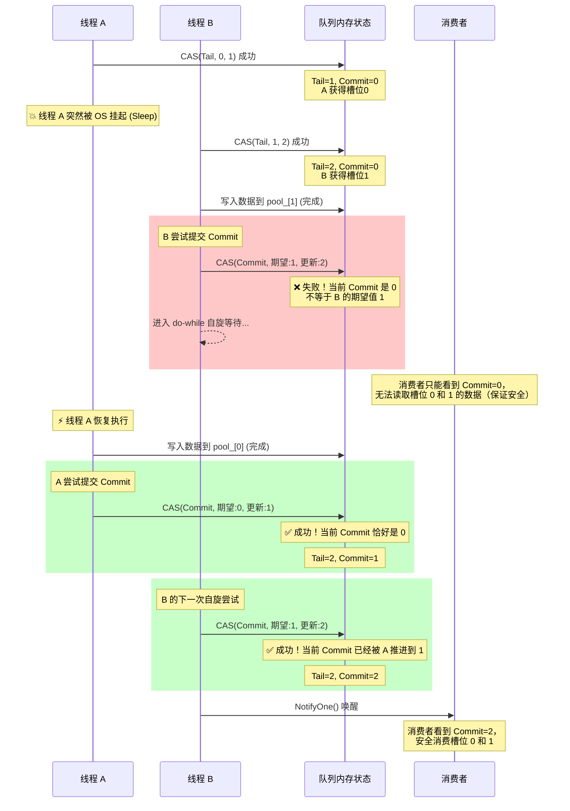

# 有界无锁队列 Enqueue 源码与 Commit 原理深度解析

## 一、 核心源码逻辑拆解（代码与理论的映射）

我们可以把传入的 `Enqueue` 函数代码严丝合缝地拆分为 **三个阶段**，核心思想：**Tail 管占位，Commit 管可见**。

### 阶段 1：CAS 无锁抢占 Tail 槽位（占位无序）
```cpp
// 读取当前 Tail
uint64_t old_tail = tail_.load(std::memory_order_acquire);
do {
    new_tail = old_tail + 1;
    // 判满逻辑：如果新 Tail 追上了 Head，说明队列满了
    if (GetIndex(new_tail) == GetIndex(head_.load(std::memory_order_acquire))) {
        return false; 
    }
// CAS 抢占：如果 tail_ 没被别人改过，就更新为 new_tail。否则重新循环抢占。
} while (!tail_.compare_exchange_weak(old_tail, new_tail, ...));
```
*   **代码映射**：这里多线程疯狂竞争 `tail_`。谁的 CAS 成功，谁就拿到了 `old_tail` 这个下标的“专属写入权”。
*   **注意**：此时仅仅是**占了个坑**，数据根本还没写进去！

### 阶段 2：写入真实数据（耗时操作，易被中断）
```cpp
pool_[GetIndex(old_tail)] = element;
```
*   **代码映射**：线程将传入的 `element` 写入自己刚刚抢到的 `old_tail` 槽位。
*   **隐患节点**：**这是引发数据乱序的元凶！** 线程在这里随时可能被操作系统挂起（比如时间片用完），导致“坑占了，但数据没填完”。

### 阶段 3：Commit 严格串行提交（提交有序，解决痛点）
```cpp
do {
    // 每次循环强制将期望值重置为自己抢到的槽位 old_tail
    old_commit = old_tail; 
// CAS 提交：只有当全局 commit_ 等于当前线程的 old_tail 时，才允许推进 commit_ 到 new_tail
} while (cyber_unlikely(!commit_.compare_exchange_weak(old_commit, new_tail, ...)));

wait_strategy_->NotifyOne(); // 唤醒消费者
```
*   **代码映射**：这是整个 Commit 机制的灵魂。`compare_exchange_weak` 发现如果 `commit_` 不等于 `old_commit`（即 `old_tail`），CAS 会失败并更新 `old_commit`。但 `do-while` 循环第一句又把 `old_commit` 强行改回 `old_tail`。
*   **大白话翻译**：“**只要全局 Commit 还没推进到我的前一个坑位，我就死等（自旋），绝不越权提交！**” 这强制保证了 Commit 是一步一步按顺序往前走的。

---

## 二、 时序图：线程 A 挂起导致的 Commit 阻塞场景

这张图生动还原了你的笔记中“二、经典并发场景复现”的过程。
假设队列初始状态：`Tail = 0`, `Commit = 0`。



---

## 三、 面试/复习极简速记卡 (One-Page Cheat Sheet)

在面试或快速回顾时，用以下 3 句话配合代码中的 3 个关键字即可瞬间理清思路：

1.  **架构定位**：RingBuffer + 无锁 CAS 并发。
2.  **核心双指针**：
    *   **Tail 指针 = 生产者的“号牌”**。（代码：第一个 `do-while`，抢到号就自增，允许乱序写入）。
    *   **Commit 指针 = 消费者的“绿灯”**。（代码：第二个 `do-while`，数据有效性的唯一标识）。
3.  **如何解决乱序导致的数据不一致？（高频考点）**
    *   **现象**：由于线程挂起，占了后置位 Tail 的线程可能先写完数据。如果没有 Commit 拦截，消费者会读到前置位还没写完的脏数据。
    *   **源码解法**：通过 `commit_.compare_exchange_weak(old_tail, new_tail)`。线程提交时，**强制要求**当前全局 `Commit` 必须等于自己的 `old_tail`。如果不等，说明前面的坑还没填满，当前线程只能在 `do-while` 里自旋死等。
    *   **总结**：**Tail 异步抢占提性能，Commit 同步按序保安全。**

*(注：这段代码中的 `std::memory_order_acquire` 和 `std::memory_order_acq_rel` 也是亮点，它们保证了内存可见性，确保 Consumer 读到 Commit 更新时，写入 pool_ 的数据一定对 Consumer 可见。这属于 C++ 内存模型的进阶考点。)*