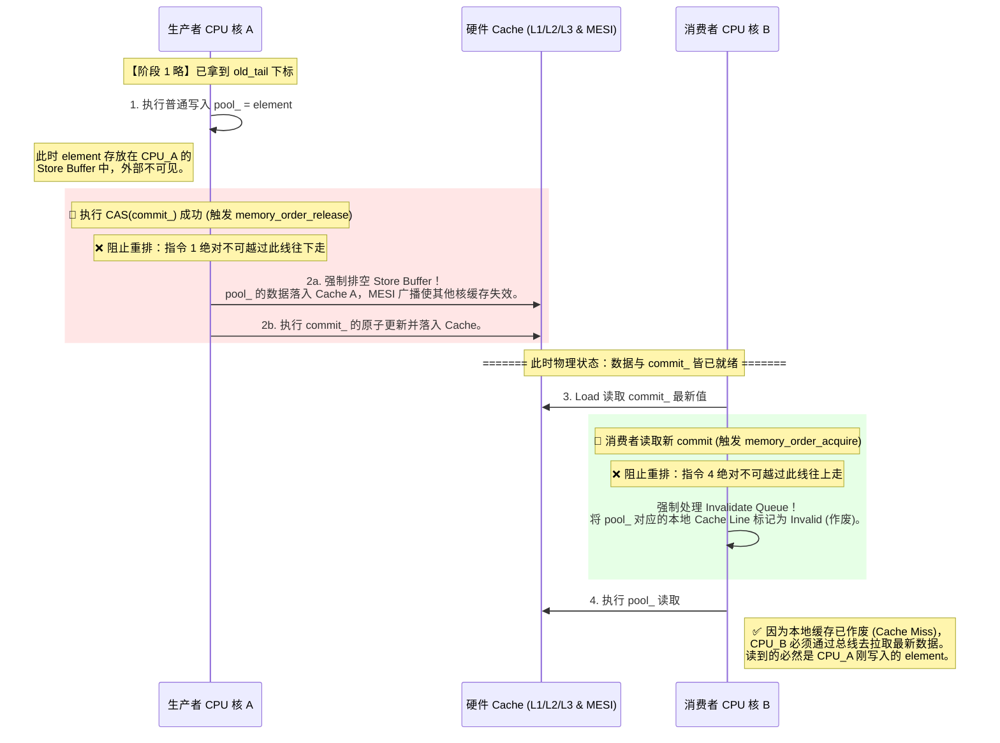
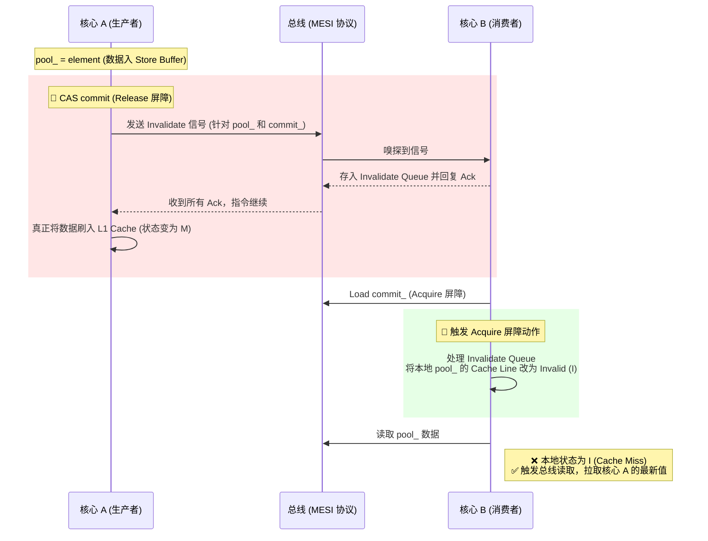

# 有界无锁队列：C++ 内存屏障（Memory Order）剖析笔记

## 一、 前置硬件真相：为什么 CAS 不够，必须加内存屏障？

在多核 CPU 架构中，CAS 只能保证对单个变量修改的原子性。如果不加内存屏障，会导致数据不一致，根源在于两大硬件机制：

1. **指令重排（Instruction Reordering）**：编译器和 CPU 流水线会打乱没有数据依赖的代码执行顺序。
2. **CPU 异步缓存架构（Store Buffer & Invalidate Queue）**：
   * **私有与共享**：每个 CPU 核心都有**私有**的 L1/L2 Cache，多个核心共享 L3 Cache 和主存。为了让私有 Cache 看起来一致，硬件实现了 **MESI 缓存一致性协议**。
   * **Store Buffer（写缓冲）**：CPU 写入数据时，为了不阻塞等待，会先写到私有的 Store Buffer 中。此时数据对其他核**不可见**。
   * **Invalidate Queue（失效队列）**：当核心 A 修改了数据(疑问1)，会给核心 B 发送“失效消息”（让你对应的缓存行作废）。核心 B 收到后为了不阻塞，会先把消息塞进 Invalidate Queue 中，并不立刻作废缓存行。

**结论**：内存屏障的作用，就是**用指令强行干预重排，并强制排空 Store Buffer 和 Invalidate Queue，让 MESI 协议立刻生效**。

---

## 二、 内存屏障的物理本质（Acquire / Release 语义）

### 1. `std::memory_order_release`（写屏障）
当执行带有 `release` 的原子写操作时：
* **阻止重排**：绝对禁止这行代码**之前**的任何读写指令，被重排到这行代码**之后**。
* **强制排空 Store Buffer**：强制将当前核心 Store Buffer 中积压的所有待写数据，冲刷到**当前核心私有的 L1 Cache** 中。一旦进入 L1 Cache，通过 MESI 协议，其他核心立刻能“嗅探”(疑问2)到并宣告(疑问3)自己私有 Cache 中的旧副本失效（全局一致性达成）。

### 2. `std::memory_order_acquire`（读屏障）
当执行带有 `acquire` 的原子读操作时：
* **阻止重排**：绝对禁止这行代码**之后**的任何读写指令，被重排到这行代码**之前**。
* **强制处理 Invalidate Queue**：强制当前核心立刻处理失效队列里的所有消息，**把对应的本地私有 Cache Line 标记为 Invalid（无效）**。这样后续读取数据时，由于本地缓存失效，CPU 被迫去主存或其他核心的 Cache 中拉取最新数据。

---

## 三、 源码行级剖析：

聚焦这段代码的三个阶段：

```cpp
// 【阶段 1：第一次 CAS】
// 抢占 Tail，包含 acq_rel。这里的 acquire 确保拿到最新 tail，且后续操作不被提前。
tail_.compare_exchange_weak(..., std::memory_order_acq_rel, ...); 

// 【阶段 2：普通写入】
// 物理状态：普通内存写入，数据大概率被扔进当前 CPU 核的 Store Buffer，其他核不可见。
pool_[GetIndex(old_tail)] = element; 

// 【阶段 3：第二次 CAS (核心同步点)】
do {
    old_commit = old_tail; 
} while (!commit_.compare_exchange_weak(old_commit, new_tail, 
                            std::memory_order_acq_rel,   // 【成功时执行】
                            std::memory_order_relaxed)); // 【失败时执行】
```

### 屏障的实际作用是阻止重排吗？
**是的，阻止重排 + 强制硬件同步。**
当阶段 3 的 `commit_` CAS 成功时，触发 `acq_rel`（包含 `release` 写屏障）。
这道屏障在阶段 2 和 阶段 3 之间划了一道铁闸：
1. **禁止重排**：CPU 绝对不能把 `pool_` 的写入动作，挪到修改 `commit_` 之后。
2. **强制刷出**：在修改 `commit_` 之前，强制把阶段 2 中 `pool_` 留在 Store Buffer 里的数据刷入 L1 Cache（触发 MESI 使得对全局可见）。因此，消费者只要看到 `commit_` 推进了，它读到的 `pool_` 数据**绝对是真实的、非空的**。

### 失败分支为何只用 `relaxed`？是因为只改了寄存器吗？
**完全正确，这是为了极致的自旋性能。**
* 当 CAS 失败时，意味着 `commit_ != old_commit`，此时硬件放弃对全局 `commit_` 内存(疑问4)的写入修改。
* CAS 唯一的动作，是把真实的 `commit_` 值读出来(疑问5)，赋给局部变量 `old_commit`（此时它存在于**寄存器**或**当前线程私有栈**中）。
* 既然没有改写任何共享内存，就不需要通知其他核心，**毫无必要去触发昂贵的 Store Buffer 冲刷**。使用 `relaxed` 仅保证该次读取是原子的（不撕裂），完美适配 `do-while` 的高频轮询。

---

## 四、 物理视角的时序同步图 (Cache & 重排维度)



---

## 五、 面试/复盘速记卡 (Hardcore Cheat Sheet)

### 1. 核心架构设计：为何双索引？
* **Tail 管抢占**：CAS 争抢下标，允许线程挂起导致的乱序占位。
* **Commit 管可见**：强制按顺序提交。CAS 校验期望值 `old_commit == old_tail`，不匹配则死等，彻底解决“消费者读到未写完的脏数据”问题。

### 2. Acquire/Release 屏障到底干了什么？
不只是阻止指令重排：
* **Release (写屏障)**：阻止前面的指令往后掉；强制排空 **Store Buffer (写缓冲)**，让修改通过 MESI 协议对全局可见。
* **Acquire (读屏障)**：阻止后面的指令往前跑；强制处理 **Invalidate Queue (失效队列)**，作废本地过期缓存，逼迫 CPU 去拉取最新数据。

### 3. Commit CAS 失败为何用 `relaxed`？
因为 CAS 失败时**没有修改共享内存**，仅将全局最新值读回到当前线程的**寄存器/私有栈局部变量**（`old_commit`）中。不对外发布数据，故无需昂贵的缓存冲刷和流水线屏障，`relaxed` 只保证读的原子性，极致压榨自旋性能。


# 缓存一致性（Cache Coherence）底层实现细节。

### 疑问 1: 修改数据发生在哪里？（Store Buffer vs. L1）
*   **物理真相**：修改数据的指令发出后，数据**先进入 Store Buffer**。
*   **触发时机**：当 Store Buffer 尝试将其中的数据写入（Flush/Commit） L1 Cache 时，CPU 会检查该缓存行（Cache Line）的状态。
*   **关键动作**：如果该行在当前核是 `Shared` 状态，CPU 必须先发送 **Read-For-Ownership (RFO)** 或 **Invalidate** 消息给总线。
*   **结论**：数据在 Store Buffer 里时对外界完全不可见；只有当它**尝试进入 L1 Cache 并成功通过总线同步**的那一刻，才真正触发了 MESI 的状态转换和消息发送。

### 疑问 2: 是“嗅探”还是“发消息”？
*   **两者结合（总线机制）**：在现代多核 CPU（如 x86 的环形总线 Ring Bus）中，这是一个“广播+监听”的过程。
*   **发送方**：修改数据的核心 A 会向总线发送一个 **Invalidate** 信号。
*   **接收方（嗅探）**：其他核心的核心控制器（Cache Controller）一直在“嗅探（Snooping）”总线上的消息。核心 B 嗅探到了发给自己的 Invalidate 信号。
*   **结论**：核心 A 主动发，核心 B 主动听。

### 疑问 3: Invalidate Queue 的处理与“宣告失效”
*   **物理真相**：核心 B 嗅探到信号后，为了不卡住自己的流水线，会立刻给核心 A 回复一个 **Invalidate Acknowledge**（确认收到），但它并没有真的立刻去改缓存状态，而是把这个信号塞进 **Invalidate Queue**。
*   **失效节点**：只有当核心 B 执行到**内存屏障（Acquire）**指令，强制处理完 Invalidate Queue 里的消息时，它才会真正地将自己 L1 Cache 里对应的 Cache Line 状态改为 **Invalid (I)**。
*   **结论**：核心 B 并不是宣告给别人看，而是**修改自己内部的状态位**。一旦状态变为 I，下一次读取该地址就会触发 Cache Miss，被迫去总线拉取核心 A 已经写好的最新数据。
---

## 物理时序图（MESI 握手视角）




### 疑问 4：L1 缓存是私有的，算共享内存吗？“放弃写入”到底指什么？

**结论：L1/L2 是“私有存储”，但它们存储的是“逻辑共享变量”的副本。**

*   **逻辑视角（程序视角）**：`commit_` 指向一个全局唯一的内存地址，所有核心都在读写它，所以它是“共享内存”。
*   **物理视角（硬件视角）**：
    *   当核心 A 修改 `commit_` 时，它其实是在**自己的私有 L1 缓存行**里改。
    *   但 MESI 协议规定：你要改这个 L1 缓存行，必须先在总线上“喊一嗓子”（发送 Invalidate 信号），把其他核手里存的该地址副本通通作废。
    *   **当这一步（总线同步）完成时，我们才称这个变量达到了“全局可见（Global Visibility）”**。

**“CAS 失败放弃写入”的物理真相：**
你说得对，物理上它就是“放弃了将新值写入 L1 并触发总线同步的过程”。
*   如果 CAS 成功：核心 A 会启动 MESI 流程，强行夺取该地址的“排他所有权（Exclusive/Modified）”，这会导致总线通信。
*   如果 CAS 失败：核心 A 发现比较结果不符，它的原子指令单元会**立刻停止写入动作**。它不会尝试修改 L1，不会去总线发消息，也不会排空 Store Buffer。对其他核心来说，就像这件事从未发生过。

---

### 疑问 5：CAS 失败更新 `old_commit`（expected）用 `relaxed`，会读到“老值”吗？

**结论：是的，完全有可能读到“老值”。但这是设计者故意留下的“性能后门”，且绝对安全。**

你可能会问：读到老值，程序不就卡死了吗？为什么说它安全？这里有两个层面的保障：

#### 1. 硬件层面的保障：MESI 协议一直在跑
内存序（Memory Order）是用来约束**指令顺序**的，但硬件层面的 **Cache Coherence（缓存一致性协议）是时刻不停在后台运作的**。
*   即便你用 `relaxed`（最弱的语义），如果另一个核修改了 `commit_` 并发出了失效信号，核心 B 的硬件电路最终还是会把那个缓存行标为失效。
*   只不过，`relaxed` 并不强制核心 B “立刻”处理失效队列。所以，**它确实可能在极其微小的纳秒级时间内读到“老值”**。

#### 2. 算法层面的保障：自旋重试（Spin-loop）
请看代码结构：它是一个 `do-while` 循环。
```cpp
do {
    old_commit = old_tail; // 每次重置期望值
} while (!commit_.compare_exchange_weak(old_commit, new_tail, acq_rel, relaxed));
```
*   如果这一次 `relaxed` 读到了老值，导致 CAS 失败：没关系，循环会立刻进入下一次。
*   在下一次循环中，或者下下一次，核心 B 总会处理完失效队列（硬件总要干活的），从而读到核心 A 写入的新 `commit_`。
*   **关键点**：在 CAS **失败**的分支里，我们不需要感知 `pool_` 数据（数据可见性不需要在这里保证）。我们唯一关心的只是 `commit_` 变量本身。

#### 3. 为什么不给失败分支加 `acquire`？
如果给失败分支加 `acquire`（读屏障）：
*   每次 CAS 失败，CPU 都要强制清空失效队列，这会频繁打断流水线，造成巨大的性能损失。
*   **设计者的智慧**：在自旋阶段，我允许你“慢一点”看到新值（读到老值也只是多跑一圈循环），但我绝对不能忍受你每次失败都执行昂贵的屏障指令。
*   **真正的同步点**：只有当 CAS **成功**的那一刻，才会执行 `acq_rel`。此时 `acquire` 语义会爆发，强制排空失效队列，确保接下来的判满逻辑或下一轮操作能看到全宇宙最精准的内存状态。

